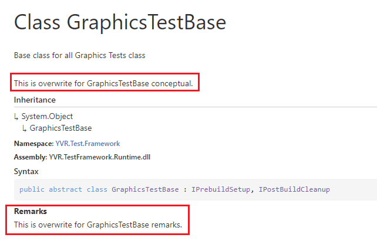

# API 文档重载

对于自动生成的 API metadata 可以通过 `markdown` 进行重写。

在 `docfx.json` 中配置重写文档的位置，如下表示 `ApiDocs` 文件夹下的所有 md 文件都是用于重写的。

```json
"overwrite": [
  {
    "files": [
      "ApisDocs/**.md"
    ]
  }
],
```

如一个典型的重写 md 文件，内容如下：

```markdown
---
uid: YVR.Test.Framework.GraphicsTestBase
remarks: *content
---

This is overwrite for GraphicsTestBase remarks.
```

其中的 `uid`  表示需要重写的对象，可在 [metadata](../GettingStarted/ProjectStructure/YAML.md#apiyaml) 中找到。

重写 md 文件中的 `remarks` 表示重写对象中需要更改的域。后面的 `*content` 表示占位，实际内容为 `---` 后的内容，在本例中即为：

```markdown
This is overwrite for GraphicsTestBase remarks.
```

> [!Note]
> 所有可重写的域可见 [Docfx 文档](https://dotnet.github.io/docfx/tutorial/intro_overwrite_files.html#data-model-inside-docfx)


当未指定域时，内容将会填充在 `conceptual` 字段中，如下代码：
```markdown
---
uid: YVR.Test.Framework.GraphicsTestBase
---

This is overwrite for GraphicsTestBase conceptual.
```

> [!Caution]
> 理论上一个 md 文件中可以重写多个对象，如：
> ```markdown
> ---
> uid: Global.YVRInputModule.rayTransform
> remarks: *content
> ---
> `rayTransform`'s position will be the interacting ray's origin point
> `rayTransform`'s forward direction will be the interacting ray's direction
> ---
> uid: Global.YVRInputModule.GetSimulatedMouseState
> ---
> Another Description
> ```
>
> 但这样可能会造成与 [docfx.json] 中 `markdownEngineName` 的冲突。
> 
> **因此推荐一个 md 只重写一个对象。**

上例中，对于 `remarks` 和 `conceptual` 的重写效果如下：



# Reference

<https://dotnet.github.io/docfx/tutorial/intro_overwrite_files.html#managed-reference-model>
