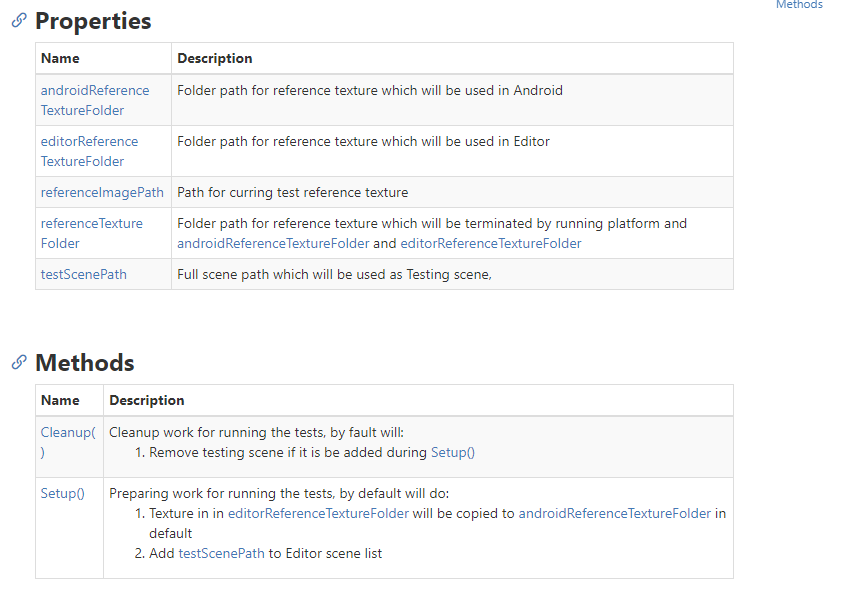
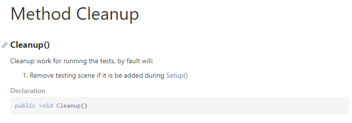
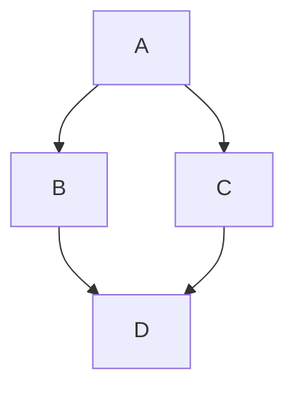

# 模板插件

> [!Note]
> Docfx 插件安装在 Docfx 工程文件夹内。因此如果文件夹内已经包含了插件内容，使用者不需要再次安装插件

## memberpage

`memberpage` 是 `Docfx` 中的一个插件，可以把类中所有的函数名和描述抽离出来构成一个页面，然后每个函数名（包括重载）再单独构成一个新的页面，如下所示：



> [!Note]
> Unity 文档即为这个风格

`memberpage` 的安装需要用到 `nuget` ， `nuget` Chocolatey 进行安装：

```powershell
choco install --yes nuget.commandline
```

当 `nuget` 安装完，进入文档文件夹，安装 `memberpage` 插件，可通过 `OutputDirectory` 参数指定安装目录，安装完会发现指定的文件夹下多出了 `memberpage.<version>` 的文件夹

```powershell
nuget install memberpage -OutputDirectory Plugins
# memberpage will be installed to Plugins/memberpage.<version> folder
# like Plugins/memberpage.2.56.6
```

将 `memberpage` 的内容目录添加至 `docfx` 的配置文件中的 `template` 中即可：

```json
// docfx.json
"template": [
    "statictoc",
    "Plugins/memberpage.2.56.6/content"
],
```

> [!Caution]
> 插件的版本与使用的 Docfx 版本强绑定

> [!Caution]
> 在安装了 `memberpage` 后， `docfx` 的编译会需要管理员权限，所以需要用 `Powershell (Admin)` 进行文档编译

## Mermaid

将 `mermaid` 的内容目录添加至 `docfx` 的配置文件中的 `template` 中即可：

```json
// docfx.json
"template": [
    "../Plugins/mermaid"
],
```

插件文件夹下，实质上只有 `scripts.tmpl.partial` 一个文件，该文件中引入了 `mermaid@9.3.0` 版本。

当引入插件后，如下的代码即能生成 Mermaid 图：
~~~markdown

~~~


# Reference

Mermaid 支持：https://github.com/dotnet/docfx/issues/2292
