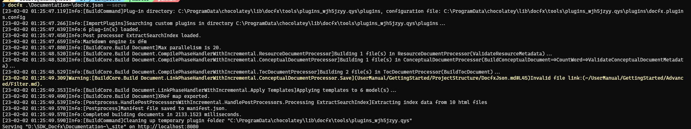

# FAQ

本部分将包含一些常见问题和解答。

## Docfx API 文档是否支持 C++ 工程？

截至目前（2.61.0 版本）原始不支持 C++ 工程。

但 Docfx API 本质上并不依赖具体的语言，而是依赖 Metadata。因此如果有工具能从 C++ 中生成 Docfx 期望的 Metadata 文件，则 Docfx 同样支持 C++ 工程。

可参考讨论：

<https://github.com/dotnet/docfx/issues/2484>

<https://github.com/dotnet/docfx/issues/6336>

## 为何无法生成 Api Metadata?

异常情况下，Docfx 将无法生成项目的 Api Metadata，这通常由以下原因造成：

1. 无有效的 `csproj` 文件

    对于 C# 工程 Docfx 将根据 `csproj` 将 C# 代码转换为 metadata，因此 `csproj` 文件的缺失将导致错误的发生。

    对于 Unity 工程，当工程被打开后，将自动生成每一个程序集的 `csproj`。若在 CI 环境下，也可以通过命令行直接生成目标工程的 `csproj` 文件：
    ```powershell
    <Unity Exe path> -projectPath <ProjectPath> -batchmode -quit -nographics -logFile -executeMethod "UnityEditor.SyncVS.SyncSolution"
    ```

2. Docfx 和 MSBuild 版本不兼容

    Docfx 依赖 MSBuild 生成 Metadata 文件。因此如果 Docfx 与 MSBuild 版本不兼容时（如 2.56.6 版本的 Docfx 配合 Visual Studio 2022 自带的 MSBuild）将会产生错误，通常将有类似如下的 Warning 输出：
    ```text
    Warning:[MetadataCommand.ExtractMetadata](D:/SDK_YTestFramework/TestProjects/TestFramework/YVR.TestFramework.Editor.csproj)Workspace failed with: [Failure] Msbuild failed when processing the file 'D:\SDK_YTestFramework\TestProjects\TestFramework\YVR.TestFramework.Editor.csproj' with message: Could not load file or assembly 'System.Collections.Immutable, Version=5.0.0.0, Culture=neutral, PublicKeyToken=b03f5f7f11d50a3a' or one of its dependencies. The system cannot find the file specified.
    ```

    解决方式：
    1. 通过 `Chocolatey` 单独安装 MSBuild，以配合 Docfx 版本
    2. 升级/降级 Docfx 以配合 MSBuild

3. 缓存文件导致
    
    如果确保非其他原因造成，但 metadata 文件仍然无法创建。可能是由于 Docfx 编译的缓存文件导致，此时应当删除 `obj` 文件夹和已经生成的静态网页路径。

## 编译时的 Warning 表示什么？

Docfx 文档编译时可能会出现各种 Warning 信息，在 Powershell 下 Warning 信息会以黄色文本展现，如下：


通常 Warning 信息的出现意味着编译文档中链接的失效，或 api metadata 生成的失败。

当文档中链接失效时，Warning 信息将会指明失效链接所在的路径，如上例中，Warning 信息中包含的 `(UserManual/GettingStarted/ProjectStructure/DocfxJson.md#L45)Invalid file` 表示失效的链接在 `DocfxJson.md` 文件的第 45 行。

> [!Note]
> 编译文档时应当要保证 0 Warning！


## 为何不使用语雀 / Notion 编写内部文档？

Docfx **并不是** Notion，语雀的替代，而是补充。

根据文档的不同属性，适合记录它的路径也会发生改变：
- 语雀：需要与全软件组共享的文档，如竞品分析 / 软件发布流程等。语雀作为新人加入团队的第一个入口，因此也应当包含基本的新手引导，引流到 Notion / Docfx 上查看更细致的文档。
- Notion：组内非项目相关的文档，如代码规范，技术分享等。
  
  同时 Notion 也可以作为项目相关文档的草稿/讨论之地，因为 Notion 包含有强大的评论功能，且可以与日常的工作管理连接。如在管理每日工作的同时，顺手在 Page 中记录下关于项目的思考。
- Docfx：项目正式文档。Docfx 提供的文本文档与代码文档的联动更加适合于作为技术项目的文档编写工具。

### 为何要区分组内共享和团队共享？

从互联网精神和理想上而言，应当扩大分享的范围，一份文档让所有人看到比一份文档只让一部分人看到能产生更多的价值。

但在实际操作中，过多分享造成信息的混乱。当一个人只需要关注一个特定工程时，却被迫要从庞杂的文档中找到这个特定工程的文档，这个步骤会造成文档阅读的欲望降低。更何况目前语雀的文档管理较为混乱，更加剧了阅读文档的难度。

如果组内共享的文档需要让组外同学查看，使用 Notion 的 Share 功能即可。

> [!Note]
> 如果未来语雀文档构建出文档分类规范后，或许会将 Notion 中文档切换至语雀。
