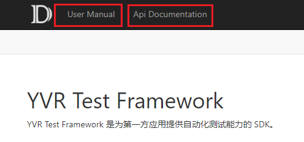

# YAML

## toc.yaml

`toc.yml` 用来指明文档的目录结构。在整个 Docfx 工程中，会存在多个 `toc.yml`，分别用来指明总的分类结构，与每个分类下的子结构。

### 总分类结构

一个表示总分类结构的 `toc.yml` 通常需要与 `docfx.json` 同一目录下。

如下示例：
```yaml
- name: User Manual
  href: UserManual/
  homepage: UserManual/introduction.md

- name: Api Documentation
  href: Apis/
  homepage: Apis/index.md
```

上例中表示整个文档需要 `UserManual` 和 `Api Documentation` 两个部分，即如下部分：


> [!Note]
> 严格意义上而言，表示总分类结构的 `toc.yml` 的具体路径是在 [docfx.json build 部分](./DocfxJson.md#build) 中的 `content` 字段中指定的，`content` 中多个 files 结构中最外层的部分即为总分类。

### 分类子结构

表示分类子结构的 `toc.yml` 处在各个分类内容所在文件夹的根目录中，如上述总 `toc.yml` 将分类内容定义在 `UserManual` 和 `Apis` 文件夹中，则子结构的 `toc.yml` 路径分别为 `UserManual/toc.yml` 和 `Apis/toc.yml` 。

`UserManual/toc.yml` 部分内容如下所示：

```yaml
- name: Introduction
  href: Introduction.md

- name: Get Started
  href: GetStarted.md
  items:
      - name: Configure Development Environment
        href: ./GetStarted/ConfigureDevelopmentEnvironment.md
      - name: Import YVR Packages
        href: ./GetStarted/ImportYVRPackages.md
      - name: Configure Unity Settings
        href: ./GetStarted/ConfigureUnitySettings.md
      - name: Build Your First App
        href: ./GetStarted/BuildYourFirstApp.md
      - name: Enable Device For Development and Testing
        href: ./GetStarted/EnableDeviceForDevelopmentAndTesting.md
```

其中：
- `name` 字段表示页面的名称。
- `href` 字段表示页面内容所使用的 markdown 文件
- `items` 字段表示各个子页面，对于每个子页面同样可以包含 `name` ，`href` 和 `items`，即子页面可以实现无限嵌套。

> [!Note]
> 总分类结构下的 `href` 指向文件夹，分类子结构的 `href` 指向单一 `markdown` 文件


该 `toc.yml` 指示生成的文档页面如下所示：


## api.yaml

由代码文件生成的 metadata 命名格式为 `<Namespace>.<ClassName>.yml`。

> [!Note]
> 如果一个类未定义命名空间，则 Namespace 将由 `Global` 替代。

如未定义命名空间的类 `YVRInputModule` 类，其 metadata 为 `Global.YVRInputModule.yml`。

在 metadata yml 文件中类和类中的成员都将由 `uid` 表示，如 `YVRInputModule` 类中的对象 `rayTransform`，在 yml 中可找到其 `uid` 为：
```yaml
- uid: Global.YVRInputModule.rayTransform
```
