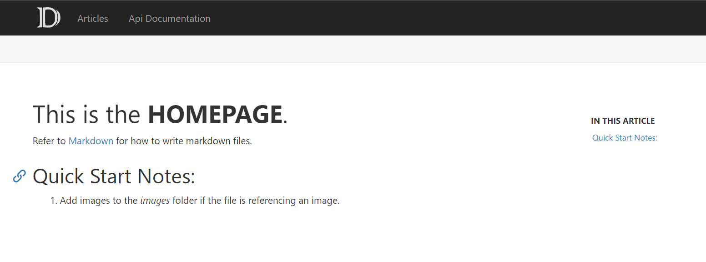

# 介绍

`DocFx` 是微软用来生成 `MSDN` 文档的工具，可以自动从 `.Net` 的源码中生成 API Documentation，也可以通过 `markdown` 生成 Articles 。一个默认的 Docfx 生成的网页如下所示：

本文档旨在阐述 Docfx 的使用方法，将包含以下内容：
- [开始使用](./GettingStarted.md)：Docfx 的环境配置介绍，Docfx 工程的目录结构介绍等
- [高级功能](./Advanced.md)：在编写文档过程中可能会使用到的 Docfx 高级功能
- [规范](./Convention.md)：为第一方工程编写文档过程中，需要遵守的规范
- [FAQ](./FAQ.md)：关于 Docfx 及文档本身的常见问题和解答

> [!Note]
> [开始使用](./GettingStarted.md) 中介绍的是 Docfx 工程的创建过程，但在日常使用中不需要每个工程都重写创建 Docfx 工程，参照 [规范](./Convention.md) 中流程使用即可。
