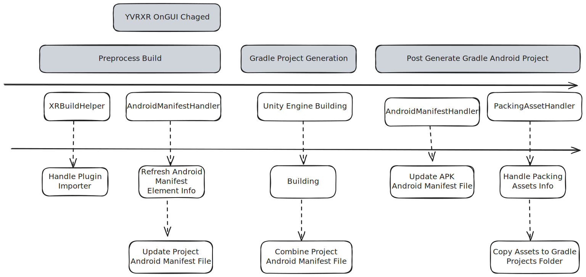
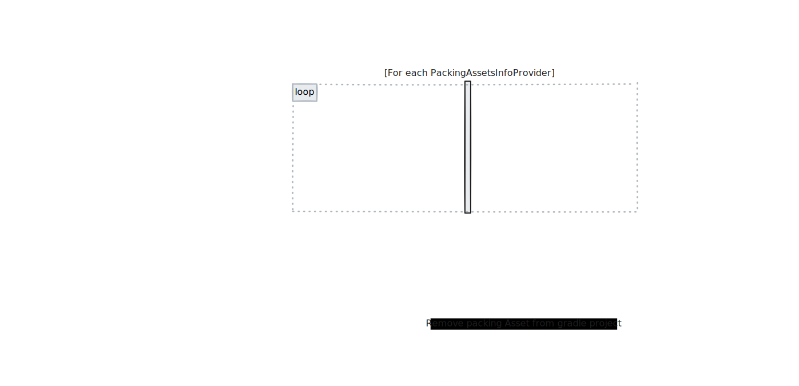

# APK 打包处理

> [!tip]
> TLDR：
>
> -   如果要修改 AndroidManifest，你应该实现 `ManifestElementInfoProvider` 派生类
> -   如果要修改 APK 中的资源，你应该实现 `PackingAssetInfoProvider` 派生类

Core SDK 在打包时会需要处理两件事：

1. 修改 Android Manifest 文件，以保证其中的权限和配置项符合应用的配置要求
2. 将部分功能依赖的资产打包进 APK 中，如 [SplashScreen](../../com.yvr.core/Documentation_CN~/AdvancedFeatures/SplashScreen.md) 中的 Splash 资产

所有的这些处理都定义在了文件夹 `YVR Core/Scripts/Editor/AndroidPackingHandlers` 中，其中针对上述需求又进一步由类 [AndroidManifestHandler](xref:YVR.Core.Editor.Packing.AndroidManifestHandler) 和 [PackingAssetHandler](xref:YVR.Core.Editor.Packing.PackingAssetHandler) 进行处理。

时序图流程如下：

需要处理的 Manifest Info 和 Assets Info 都会先存储在 [YVRSDKSettingAsset](xref:YVR.Core.YVRSDKSettingAsset) 中，然后再进一步更新到 AndroidManifest 文件和打包的 APK 中。

> [!note]
>
> 在 XR Plugin Management 的 YVR 分类下进行修改时，同样会触发 [AndroidManifestHandler.RefreshManifestElementInfo](xref:YVR.Core.Editor.Packing.AndroidManifestHandler.RefreshManifestElementInfo) 进行 ManifestInfo 的更新。
>
> 理想上 PackingAsset 也应当进行同样的操作，即当 UI 发生变化和在编译前就更新好相关的信息，但因为 [PackingAssetInfo.apkAssetPath](http://192.168.9.237:8081/sdk-utilities/api/YVR.Utilities.Editor.PackingProcessor.PackingAssetInfo.apkAssetPath.html) 字段要求 Gradle 项目的地址，而该地址仅在编译时才会被确定，因此在 UI 中无法直接获取到该地址，所以 PackingAssetInfo 的更新只能在编译时进行。

## AndroidManifestHandler

> [!important]
>
> 强烈建议，先阅读 [ManifestTagInfo](http://192.168.9.237:8081/sdk-utilities/Documentation~/CoreModules/PackingProcessor/ManifestTagInfo.html) 文档

Manifest Info 由类 [ManifestTagInfo](http://192.168.9.237:8081/sdk-utilities/Documentation~/CoreModules/PackingProcessor/ManifestTagInfo.html) 进行描述，对于每一个 [ManifestTagInfo](http://192.168.9.237:8081/sdk-utilities/Documentation~/CoreModules/PackingProcessor/ManifestTagInfo.html) 对象都应当建立一个对应的 [ManifestElementInfoProvider](xref:YVR.Core.Editor.Packing.ManifestElementInfoProvider) 对象来进行处理：

-   需实现[HandleManifestElementInfo](xref:YVR.Core.Editor.Packing.ManifestElementInfoProvider.HandleManifestElementInfo) 函数，函数内创建 [ManifestTagInfo](http://192.168.9.237:8081/sdk-utilities/Documentation~/CoreModules/PackingProcessor/ManifestTagInfo.html) 对象，并通过函数 [AndroidManifestHandler.UpdateManifestElement](<xref:YVR.Core.Editor.Packing.AndroidManifestHandler.UpdateManifestElement(System.String,YVR.Utilities.Editor.PackingProcessor.ManifestTagInfo)>) 将其更新到 [YVRSDKSettingAsset.manifestTagInfosLis](xref:YVR.Core.YVRSDKSettingAsset.manifestTagInfosList) 中。
-   实现 [ManifestElementInfoProvider.manifestElementName](xref:YVR.Core.Editor.Packing.ManifestElementInfoProvider.manifestElementName)，其值为 ManifestInfo 中的 `attrValue`。
-   定义 `InitializeOnLoad` 的函数，将自己的实例注册进 `AndroidManifestHandler.manifestElementInfoProviders` 中供后续遍历使用。

> [!tip]
>
> 对于同一 Feature 的多个 ManifestTagInfo，可以将其放在同一个 ManifestElementInfoProvider 中进行处理，如 [OpenXRLoaderManifestElementInfoProvider](http://192.168.9.247:8001/unity/sdk-core/-/blob/master/com.yvr.core/Scripts/Editor/AndroidPackingHandlers/ManifestElementInfoProvider/OpenXRLoaderManifestElementInfoProvider.cs?ref_type=heads)

`ManifestElementInfoProvider` 的实现具体可参考：[ManifestElementInfoProvider 文件夹](http://192.168.9.247:8001/unity/sdk-core/-/tree/master/com.yvr.core/Scripts/Editor/AndroidPackingHandlers/ManifestElementInfoProvider?ref_type=heads)

整体的流程如下

## PackingAssetHandler

对于 Packing Asset 的处理与 ManifestInfo 的处理类似，其信息由类 [PackingAssetInfo](http://192.168.9.237:8081/sdk-utilities/Documentation~/CoreModules/PackingProcessor/PackingAssetInfo.html) 进行描述，处理的方式也与 ManifestInfo 类似：对于每一个 `PackingAssetInfo` 对象都应当建立一个对应的 [PackingAssetInfoProvider](xref:YVR.Core.Editor.Packing.PackingAssetsInfoProvider) 对象来进行处理，其与 [ManifestElementInfoProvider](xref:YVR.Core.Editor.Packing.ManifestElementInfoProvider) 逻辑基本类似，此不赘述。

实现示例可参考 [ScreenSplashAssetsInfoProvider](http://192.168.9.247:8001/unity/sdk-core/-/blob/master/com.yvr.core/Scripts/Editor/AndroidPackingHandlers/PackingAssetsProvider/ScreenSplashAssetsInfoProvider.cs?ref_type=heads)，整体的调用顺序如下

