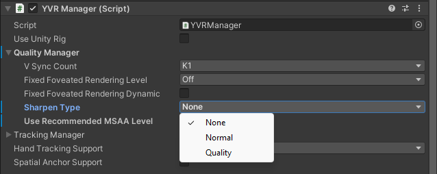

# 超采样和锐化

启用超采样或锐化功能可以提高图像质量。超采样可以让画面质量进一步提升，适用于解决下采样时的闪烁及摩尔纹等问题。锐化可以提升清晰度，改善上采样时的图像模糊问题。

## 开启超采样功能

使用合成层选择超采样类型：   

1. 在 **Compositor Layer** 设置中，
     
    
     
    选择 **Super Sampling Type**：
        - **None**
        - **Normal**
        - **Quality**

## 开启锐化功能

使用 YVR 管理器选择锐化类型：

1. 在 **YVR Manager** 设置中， 
     
    
     
    选择 **Sharpen Type**：
        - **None**
        - **Normal**
        - **Quality**

## 注意事项

- 使用锐化时，申请的 swapchain 请开启多层 mipmap，并在提交前为其每层 mipmap 生成纹理数据。
- 在 OpenXR 中，所有设置都只是建议，合成器可以根据需要启用或禁用它们。
- 合成图层过滤需要更多的 GPU 资源。对于锐化和超采样算法尤其如此，在开发时，您应该权衡增加的视觉保真度与提供最佳 VR 用户体验所需的额外 GPU 资源。

## 示例

请参考以下示例项目。

1. 打开一个新项目或当前项目。

2. 导入最新版 SDK。

3. 在 Project 面板下，选择 **Pacakages** > **YVR Core** > **Scenes** > **CompositeLayer**。

4. 在 CompositeLayer 文件夹中，选择 **CompositeLayerSuperSamplingSharpen.unity** 打开该场景。

5. 在 **File** > **Build Settings...** 下，选择 **Add Open Scenes**。

6. 选择 **Build** 并为文件命名。 

7. 在设备上安装 APK 文件。