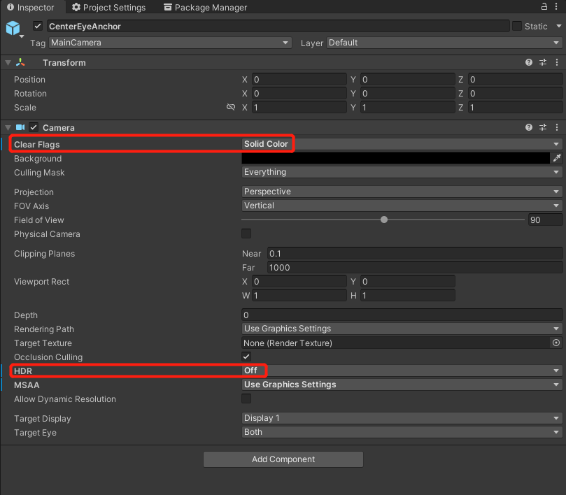

# 透视

透视这项功能允许用户走出 VR 世界看到现实生活中的东西。它使用 HMD 摄像头和图像处理算法来捕捉和接近用户在直接透过 HMD 显示屏时看到的东西。这最终实现了现实世界和虚拟场景的融合，创造出一个混合现实的场景。


## 要求

- SDK 版本: 2.3.0 及以上


## 配置设置

1. 完成入门指南。如果已完成，请跳过此步骤。 

2. 在主摄像机中，选择 `CenterEyeAnchor`。

3. 选择 `Inspector -> Camera`。

4. 设置 `Clear Flags` 为 **Solid Color**，`HDR` 为 **Off**。

    

5. 设置 `Background` 为 **RGBA (0000) / Hexadecimal 000000**。

    

6. 在项目中设置透视开关 `YVRManager.instance.hmdManager.SetPassthrough(true);`。

## 透视图像风格

如果需要对透视画面进行颜色调整，可以在场景中添加 `PassthroughLayer` 组件，并通过 `Color Map Type` 选择颜色映射方式。使用 LUT 时，可以设置 `Color Lut Source Texture`、`Lut Weight` 和 `Flip Lut Y`。

运行时也可以通过 `PassthroughColorLut` 创建和更新颜色查找表，再将其设置到 `PassthroughLayer`：

```csharp
public PassthroughLayer passthroughLayer;
public Texture2D lutTexture;

private PassthroughColorLut m_Lut;

public void ApplyPassthroughLut()
{
    if (!PassthroughColorLut.IsTextureSupported(lutTexture, out string message))
    {
        Debug.LogError(message);
        return;
    }

    m_Lut = new PassthroughColorLut(lutTexture);
    passthroughLayer.SetColorLut(m_Lut);
}

private void OnDestroy()
{
    m_Lut?.Dispose();
}
```

> [!Note]
> LUT 纹理支持 `RGB24` 和 `RGBA32` 格式。纹理尺寸需要能表示一个三维颜色立方体，例如水平布局或方形布局的 LUT 图。

## 透视图层

当需要将透视画面作为独立图层参与合成时，可以使用 `PassthroughLayer` 管理透视图层的风格和颜色映射。若应用同时使用合成层、透明背景和透视画面，请确保主摄像机背景透明，并合理设置各图层的深度，避免 Eye Buffer 完全遮挡透视内容。

> [!CAUTION]
> 透视图层和颜色 LUT 会增加额外的系统合成和图像处理开销。建议只在确实需要混合现实效果或颜色校正时启用，并在不需要时释放 LUT 对象。
