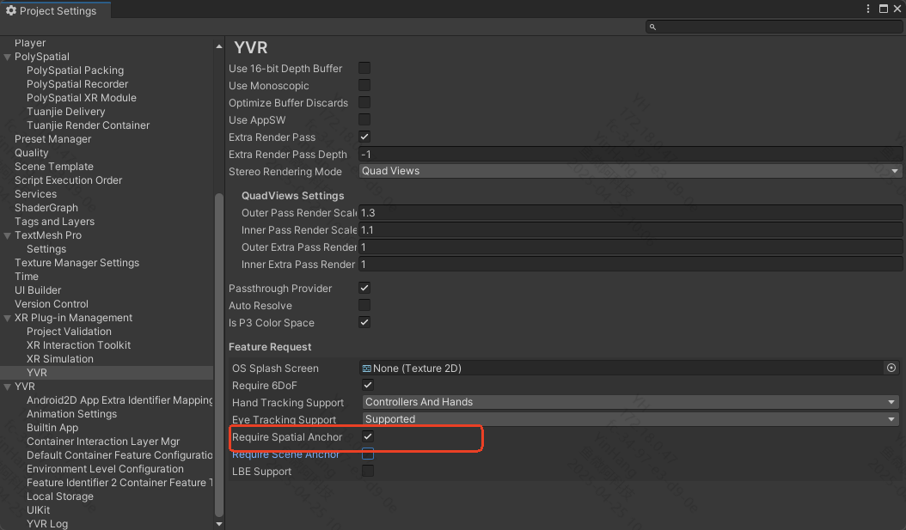

# 空间锚点
## 介绍

空间锚点(Spatial Anchors)是在虚拟或增强现实环境中用于定位和跟踪物体或场景的关键点。它们可以被用来实现虚拟物体的稳定放置、环境理解、共享虚拟场景等功能。空间锚点是一种由软件和硬件共同实现的技术，能够将虚拟内容与现实世界中的特定位置或物体相对应起来。

## 基本概念

| 名称 | 说明 |
| --- | --- |
| UUID | 锚点的唯一标识码，在创建锚点时返回 |
| anchorHandle | 锚点的句柄，在应用内存中的标识 |

## 为应用开启空间锚点权限

1. 在 Unity 中打开项目
2. 为场景添加 XR Origin
3. 添加 YVRManager 脚本
4. 在项目中打开`ProjectSettings` 选择 `XR Plug-in Management` 下 `YVR` 面板勾选 `Spatial Anchor Support`
    
```ad-note
勾选 SpatialAnchorSupport 选框后，AndroidManifest.xml 文件中会添加锚点对应权限
**\<uses-permission android:name="com.yvr.permission.USE_ANCHOR_API"\\>**
```
## 空间锚点接口
### 创建锚点

``` CSharp
/// <summary>  
/// 使用给定的位置和旋转创建空间锚点。  
/// </summary>  
/// <param name="position">锚点位置</param>  
/// <param name="rotation">锚点旋转</param>  
/// <param name="result">创建锚点的接口回调</param>
public void CreateSpatialAnchor(Vector3 position, Quaternion rotation, Action<YVRSpatialAnchorResult,bool> result) 
```
创建锚点后会响应 **Action<YVRSpatialAnchorResult,bool>** 回调，YVRSpatialAnchorResult 返回锚点信息，bool 表示锚点创建是否成功。
```CSharp
public struct YVRSpatialAnchorResult  
{  
    //任务 Id
    public ulong requestId;  
    //锚点的句柄
    public ulong anchorHandle;  
    //锚点的唯一标识码
    public Char[] uuid;  
}
```
代码示例
```CSharp
public void CreateSpatialAnchor(Transform transform)  
{  
    YVRSpatialAnchor.instance.CreateSpatialAnchor(transform.position, transform.rotation, OnCreateSpatialAnchor);  
}  
  
private void OnCreateSpatialAnchor(YVRSpatialAnchorResult result, bool success)  
{  
    if(!success)  
    {  
        Debug.LogError("Create spatial anchor failed!" );  
        return;    
    }  
    
    Debug.Log("Create spatial anchor success");
    //TODO 自定义逻辑
}
```
### 保存锚点
调用 **YVRSpatialAnchor.instance.SaveSpatialAnchor** 接口保存锚点，可以将锚点保存在本地设备中或保存在云端，**将锚点保存在云端需要用户已登陆设备账号并且设备联网**

```CSharp
/// <summary>  
/// 使用提供的保存信息保存空间锚点  
/// </summary>  
/// <param name="saveInfo">保存信息</param>  
/// <param name="callback">保存结果回调</param>  
public void SaveSpatialAnchor(YVRSpatialAnchorSaveInfo saveInfo, Action<YVRSpatialAnchorSaveCompleteInfo,bool> callback)
```
保存锚点参数信息 **YVRSpatialAnchorSaveInfo**
```CSharp
public struct YVRSpatialAnchorSaveInfo  
{  
    // 需要保存锚点的句柄
    public ulong anchorHandle;  
    // 保存位置 Local: 本地内存，Cloud: 云端
    public YVRSpatialAnchorStorageLocation storageLocation; 
}
```
保存结果的回调 **Action<YVRSpatialAnchorSaveCompleteInfo,bool>**
YVRSpatialAnchorSaveCompleteInfo 保存结果信息，bool 保存是否成功
```CSharp
public struct YVRSpatialAnchorSaveCompleteInfo  
{  
    // 任务 Id
    public ulong requestId;  
    // 返回结果码
    public int resultCode;
    // 保存的锚点句柄
    public ulong anchorHandle;  
    // 保存的锚点 UUID
    public char[] uuid;  
    // 保存的位置
    public YVRSpatialAnchorStorageLocation location;  
}
```
代码示例：
```CSharp
private void SaveAnchor(ulong anchorHandle)
{
    YVRSpatialAnchorSaveInfo saveInfo = new YVRSpatialAnchorSaveInfo();  
    saveInfo.anchorHandle = anchorHandle;  
    // 保存至本地
    saveInfo.storageLocation = YVRSpatialAnchorStorageLocation.Local; 
    // 保存至云端
    //saveInfo.storageLocation = YVRSpatialAnchorStorageLocation.Cloud;   
    YVRSpatialAnchor.instance.SaveSpatialAnchor(saveInfo, OnSaveCompleteCallback);
}

private void OnSaveCompleteCallback(YVRSpatialAnchorSaveCompleteInfo saveResult,bool success)  
{  
    Debug.Log("Save anchor result:" + success); 
}
```
### 删除锚点
调用 **YVRSpatialAnchor.instance.EraseSpatialAnchor()** 接口删除指定位置指定锚点
```CSharp
/// <summary>  
/// 根据锚点句柄和存储位置删除对应的空间锚点  
/// </summary>  
/// <param name="anchorHandle">需要删除的锚点句柄</param>  
/// <param name="location">锚点的存储位置</param>  
/// <param name="callback">删除结果的回调</param>  
public void EraseSpatialAnchor(UInt64 anchorHandle, YVRSpatialAnchorStorageLocation location,Action<YVRSpatialAnchorResult,bool> callback)
```
删除结果回调 **Action<YVRSpatialAnchorResult,bool>** YVRSpatialAnchorResult 删除的锚点，bool 是否成功

代码示例：
```CSharp
private void EraseSpatialAnchor()
{
    YVRSpatialAnchor.instance.EraseSpatialAnchor(m_spatialAnchor.spaceHandle, YVRSpatialAnchorStorageLocation.Local,  
    OnEraseCompleteCallback);
}

private void OnEraseCompleteCallback(YVRSpatialAnchorResult result,bool success)
{
    Debug.Log($"Erase anchor:{result.anchorHandle}, uuid:{new string(result.uuid)} {success}");
}
```
### 查询锚点
调用 **YVRSpatialAnchor.instance.QuerySpatialAnchor** 查询锚点
```CSharp
/// <summary>  
/// 根据提供的查询信息查询空间锚点  
/// </summary>  
/// <param name="queryInfo">查询信息</param>  
/// <param name="queryCallback">查询结果</param>  
public void QuerySpatialAnchor(YVRSpatialAnchorQueryInfo queryInfo , Action<List<YVRSpatialAnchorResult>> queryCallback)
```
YVRSpatialAnchorQueryInfo 查询信息，支持通过 uuid 查询，或者 component 类型查询
```CSharp
public struct YVRSpatialAnchorQueryInfo  
{  
    // 查询返回最多锚点个数(默认为零，表示不限制查询返回个数)
    public uint MaxQuerySpaces;
    // 查询超时时间(默认为零，表示不设置超时时间)
    public double Timeout;
    // 查询位置
    public YVRSpatialAnchorStorageLocation storageLocation; 
    // 查询锚点的组件类型
    public YVRSpatialAnchorComponentType component;
    // 使用 uuid 查询锚点时 uuid 个数
    public int numIds;  
    // uuid 查询列表
    public YVRSpatialAnchorUUID[] ids;  
}
```

代码示例：
```CSharp
// 查询当前引用在这台设备中保存的所有本地锚点
private void QueryAllLocalAnchor()
{
    YVRSpatialAnchorQueryInfo queryInfo = new YVRSpatialAnchorQueryInfo();  
    queryInfo.storageLocation = YVRSpatialAnchorStorageLocation.Local;
    YVRSpatialAnchor.instance.QuerySpatialAnchor(queryInfo, QuerySpatialAnchorComplete);
}

// 通过 uuids 查询之前保存在云端的锚点
private void QuerryUUIDsAnchor(List<char[]> uuids)
{
    YVRSpatialAnchorQueryInfo queryInfo = new YVRSpatialAnchorQueryInfo();  
    queryInfo.storageLocation = YVRSpatialAnchorStorageLocation.Cloud;  
    queryInfo.ids = new YVRSpatialAnchorUUID[uuids.Count];
    for(int i = 0; i < uuids.Count; i++)
    {
        queryInfo.ids[i] = new YVRSpatialAnchorUUID();  
        queryInfo.ids[i].Id = uuids[i];
    }
    
    YVRSpatialAnchor.instance.QuerySpatialAnchor(queryInfo, QuerySpatialAnchorComplete);
}

// 查询结果
private void QuerySpatialAnchorComplete(List<YVRSpatialAnchorResult> results)
{
    Debug.Log("QuerySpacesComplete count:" + results.Count);
}
```

```ad-note
在同一片区域查询已保存过的锚点时，可能会查询不到锚点，可以尝试在周围进行走动，采集更多点云数据后再次调用查询，接口调用频率可自行决定，**建议 1 秒左右调用一次**
```
### 获取锚点的实时位姿

调用 **YVRSpatialAnchor.instance.GetSpatialAnchorPose** 接口获取锚点的实时位置，保持锚点的位置始终固定，若不获取，当用户在场景内移动或者进行 recenter 时，锚点的位置可能会发生偏移，支持每帧调用。
```CSharp
/// <summary>  
/// 获取锚点位姿  
/// </summary>  
/// <param name="anchorHandle">锚点句柄</param>  
/// <param name="position">返回锚点的位置</param>  
/// <param name="rotation">返回锚点的旋转</param>  
/// <param name="locationFlags">锚点的位置状态</param>  
/// <returns></returns>  
public bool GetSpatialAnchorPose(ulong anchorHandle, out Vector3 position, out Quaternion rotation,out YVRAnchorLocationFlags locationFlags)
```
```ad-note
当获取锚点位姿方法返回失败，或位置状态为未追踪时，表示当前地图发生了切换，此时锚点变为失效，返回的位姿可能是错误的，需要等用户回到创建锚点的地图下，或创建锚点的地图和其他地图融合时，锚点会再次有效。
```
### 获取锚点支持的 component 枚举类型
调用 **YVRSpatialAnchor.instance.GetSpatialAnchorEnumerateSupported** 可以获取指定锚点支持的 component 类型，目前第三方引用创建的锚点仅支持位姿(Locatable)、存储(Storable)、分享(Sharable)。
```CSharp
/// <summary>  
/// 获取锚点支持的 component 枚举类型  
/// </summary>  
/// <param name="anchorHandle">锚点的句柄</param>  
/// <param name="components">支持的 component 类型</param>
public void GetSpatialAnchorEnumerateSupported(ulong anchorHandle, out YVRSpatialAnchorSupportedComponent components)
```

### 设置锚点的 component 状态
调用 **YVRSpatialAnchor.instance.SetSpatialAnchorComponentStatus()** 方法可以锚点的 component 状态。创建的锚点默认包含位姿(Locatable)，存储(Storable)，分享(Sharable).
```CSharp
/// <summary>  
/// 设置锚点的 component 状态  
/// </summary>  
/// <param name="anchorHandle">锚点句柄</param>  
/// <param name="setInfo">状态信息</param>  
/// <param name="callback">设置锚点状态的回调</param>  
/// <returns></returns>  
public bool SetSpatialAnchorComponentStatus(ulong anchorHandle, YVRSpatialAnchorComponentStatusSetInfo setInfo,  
    Action<YVRSpatialAnchorSetStatusCompleteInfo,bool> callback)
```

代码示例：

```CSharp
private void DisableAnchorStorableState(ulong anchorHandle)
{
    YVRSpatialAnchorComponentStatusSetInfo componentStatusSetInfo = new YVRSpatialAnchorComponentStatusSetInfo();  
    componentStatusSetInfo.component = YVRSpatialAnchorComponentType.Storable;
    //将创建锚点的 Storable 设置为 false 时，锚点将不能被保存。
    componentStatusSetInfo.enable = false;    YVRSpatialAnchor.instance.SetSpatialAnchorComponentStatus(result.anchorHandle, componentStatusSetInfo,null);
}
```
```ad-note
上面示例中代码将关闭锚点的存储权限
```
### 获取锚点指定 component 状态
通过调用 **YVRSpatialAnchor.instance.GetSpatialAnchorComponentStatus** 可以获取锚点对应组件状态
```CSharp
/// <summary>  
/// 获取锚点指定 component 状态  
/// </summary>  
/// <param name="anchorHandle">锚点句柄</param>  
/// <param name="componentType">组件类型</param>  
/// <param name="status">返回的状态信息</param>  
public void GetSpatialAnchorComponentStatus(ulong anchorHandle, YVRSpatialAnchorComponentType componentType, out YVRSpatialAnchorComponentStatus status)
```

### 批量保存锚点
**YVRSpatialAnchor.instance.SaveSpatialAnchorList** 一次保存多个锚点
```CSharp
/// <summary>  
/// 批量保存锚点  
/// </summary>  
/// <param name="spatialAnchorHandleList">锚点句柄集合</param>  
/// <param name="location">保存位置</param>  
/// <param name="callback">保存结果回调</param>  
public void SaveSpatialAnchorList(List<ulong> spatialAnchorHandleList, YVRSpatialAnchorStorageLocation location,  
    Action<bool> callback)
```
### 通过 anchorHandle 获取锚点 UUID
调用 **YVRSpatialAnchor.instance.GetSpatialAnchorUUIDForHandle** 通过锚点句柄获取锚点的唯一标识
```CSharp
/// <summary>  
/// 通过锚点句柄获取锚点的唯一标识  
/// </summary>  
/// <param name="anchorHandle">锚点句柄</param>  
/// <param name="uuid">锚点唯一标识</param>  
public void GetSpatialAnchorUUIDForHandle(ulong anchorHandle, out YVRSpatialAnchorUUID uuid)
```
## 获取空间标定锚点信息
只有系统中的 **空间标定** 应用创建的锚点才支持设置标定信息，包括锚点组件，语义标签，平面信息，立方体信息。你可以使用 **空间标定** 接口获取锚点的标定信息，然后在自己的引用内使用，详情参考 **空间标定** 文档。 

## Demo
[SpatialAnchorSample](https://github.com/YVRDeveloper/SpatialAnchorSample-Unity) 示例展示空间锚点的相关功能，包括创建锚点，保存锚点，删除锚点，查询锚点，分享锚点等功能。当演示分享功能时，需要你手动配置自己的 photon id 及服务。