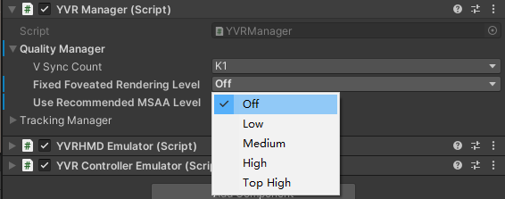
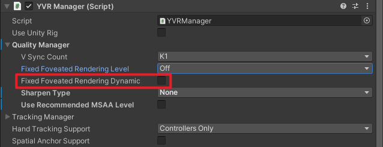

# Fixed Foveated Rendering

Fixed Foveated Rendering (FFR) renders the edges of eye render texture at a lower resolution than the center, which reduce the GPU load due to the lower fragment shader requirements. Thus, contents with high fragment shader calculations will see the most performance benefit from using FFR.

The level of FFR can be adjusted via [YVRManager](xref:YVR.Core.YVRManager) as the following image, the higher level will lead to lower GPU load but blurred result in the edge of eye render texture.

FFR level can be modified per frame which means you can switch the FFR level according to the content in the run-runtime. However, the jump between different FFR levels may be noticeable, thus it is highly recommended change the FFR level while switching the scenes.

Keep in mind that GPU performance improvement brought by FFR comes at the cost of reduction in the effect of the edges of the eye render textures. Thus, while using FFR, you should pay attention to the balance between visual quality and GPU performance.

> [!Warning]
> FFR is not the silver bullet for GPU performance issues.

## Enable Dynamic FFR

To enable dynamc FFR, select the Fixed Foveated Rendering Dynamic checkbox under YVR Manager settings. 
    