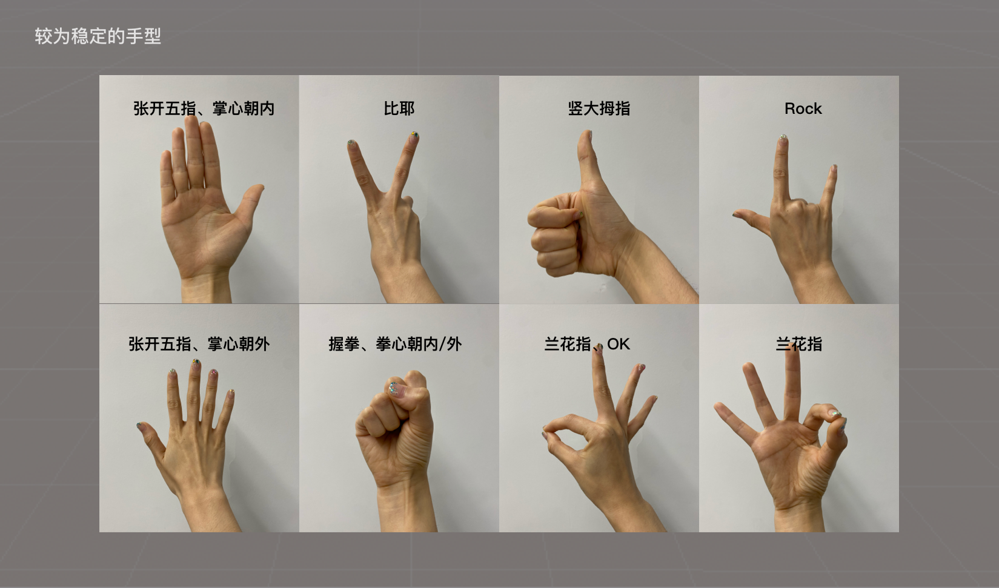
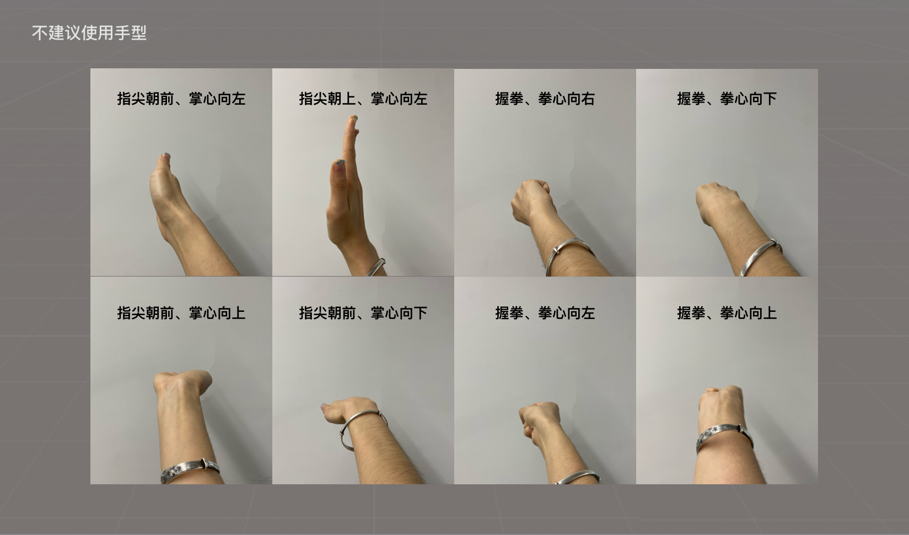
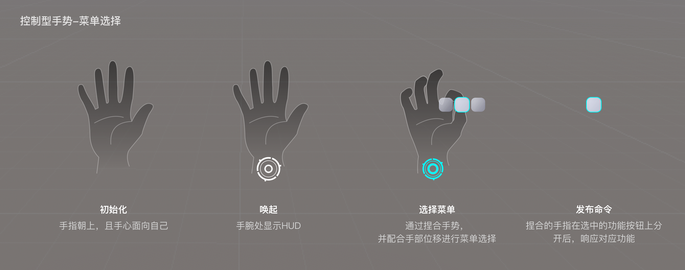

# Third-Party Hand Gesture Recognition Limitations

This document outlines some constraints on the application of hand gestures in recognition to avoid common recognition errors. It is divided into three parts:

- Part One: Static Hand Gestures, explaining static hand gestures, including recommended and not recommended hand gestures;
- Part Two: Dynamic Hand Gestures, explaining the boundaries of different types of movements for hand gestures;
- Part Three: YVR Control Gestures, recommending third-party applications to avoid using these gestures to prevent accidental triggers during application runtime.

## Static Hand Gestures

It is recommended to use hand gestures that users can perform naturally and comfortably, which are more ergonomic. In terms of gesture recognition, it is suggested to use:

- Hand gestures with **more visible features**, i.e., gestures where more hand features can be seen
- Preferably use the **right hand**
- The following image is only a partial illustration
       
    

 
Twisted, awkward, and unnatural gestures are not recommended. Additionally, in terms of algorithms, it is not suggested to use:

- Hand gestures with **fewer visible features**, i.e., gestures where fewer hand features can be seen
- Avoid using **overlapping hands** gestures, such as crossed hands
- The following image is only a partial illustration, similar **gestures (left/right) are not recommended**
      
    

## Dynamic Hand Gestures

Dynamic hand gestures can be understood as: static hand gestures + time duration judgment. Therefore, combined with the usage recommendations for static hand gestures, it is not recommended to use fast-moving gestures:

- Fast **waving** of various hand gestures, such as quickly waving the palm, fist, etc.
- Fast **rotating** of various hand gestures, such as quickly rotating the wrist, etc.
- Fast execution of **dynamic gestures**, such as quickly making a fist, quickly pinching, etc.
- Fast **moving** of various hand gestures, such as quickly moving various hand gestures in different directions

## Control Gestures

The following are YVR's control system gestures. It is recommended to avoid using these gestures for game interaction in third-party applications to prevent accidental triggering of the system menu. The current version includes the following control gestures:

- Initialization: Palm facing yourself, fingertips pointing upwards
- Activation: When the wrist is in position and the system icon appears, activation is successful
- Menu selection: Use the pinching gesture and move the hand to select the menu
- Command execution: Hover over the button, separate the index finger and thumb, the secondary menu fades out, only the function button is displayed (disappears after flashing for a certain time) and responds to its corresponding function

