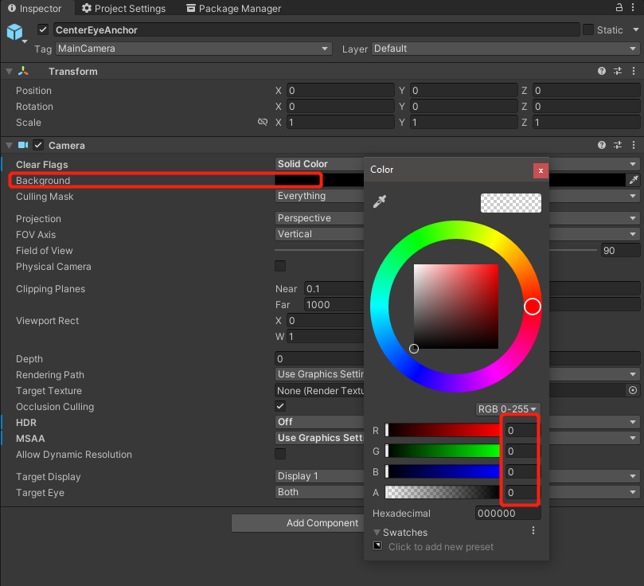

# Passthrough

Passthrough is a feature allowing users to step outside of the VR world and see what's around in real life. It uses HMD cameras and image processing algorithms to capture and approximate what users would see if they could directly look through the display of the HMD. This finally enables the blend of the real-world and the virtual scenes to create a mixed-reality scene.


## Requirement

- SDK Version: 2.3.0 


## Configure Settings

1. Complete Get Started guide, skip this if you have completed. 

2. In the main camera, select `CenterEyeAnchor`.

3. Go to `Inspector -> Camera`. 

4. Set `Clear Flags` to **Solid Color** and `HDR` to **Off**.

    

5. Set `Background` to **RGBA (0000) / Hexadecimal 000000**.

    

6. `YVRManager.instance.hmdManager.SetPassthrough(true);` enable passthrough in your project.

## Passthrough Image Style

To adjust passthrough image colors, add a `PassthroughLayer` component to the scene and select the color mapping mode through `Color Map Type`. When using a LUT, configure `Color Lut Source Texture`, `Lut Weight`, and `Flip Lut Y`.

You can also create and update a color lookup table at runtime through `PassthroughColorLut`, then assign it to `PassthroughLayer`:

```csharp
public PassthroughLayer passthroughLayer;
public Texture2D lutTexture;

private PassthroughColorLut m_Lut;

public void ApplyPassthroughLut()
{
    if (!PassthroughColorLut.IsTextureSupported(lutTexture, out string message))
    {
        Debug.LogError(message);
        return;
    }

    m_Lut = new PassthroughColorLut(lutTexture);
    passthroughLayer.SetColorLut(m_Lut);
}

private void OnDestroy()
{
    m_Lut?.Dispose();
}
```

> [!Note]
> LUT textures support `RGB24` and `RGBA32` formats. The texture size must describe a 3D color cube, such as a horizontal or square LUT layout.

## Passthrough Layers

When passthrough needs to participate in composition as an independent layer, use `PassthroughLayer` to manage passthrough layer style and color mapping. If the application uses composition layers, transparent camera background, and passthrough together, keep the main camera background transparent and set layer depths carefully so that the Eye Buffer does not fully occlude passthrough content.

> [!CAUTION]
> Passthrough layers and color LUTs add extra system composition and image-processing cost. Enable them only when the application needs mixed-reality blending or color correction, and release LUT objects when they are no longer needed.
